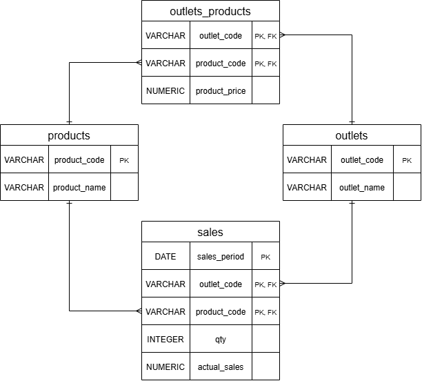

# Data Engineer Pharos Techincal Test - HAFIZ

**Repository ini merupakan hasil technical test Muhammad Hafiz Ikhsan untuk proses rekrutmen PT. Pharos Indonesia**
<br>

---

## Database Design

### Entity Relationship Diagram (ERD) Notasi Crow's



**_Penjelasan_**

- Normalisasi data yang merupakan key value ke dalam tabel sendiri, yaitu data outlet(outlet_code, outlet_name) dan product(product_code, product_name)
- Tabel outlets_products menggunakan composite keys pada outlet_code dan product_code karena asumsi saya setelah melihat data adalah setiap outlet memiliki harga yang berbeda untuk tiap product walaupun itu product yang sama
- Tabel sales juga menggunakan composite keys pada sales_period, outlet_code, product_code karena asumsi saya setelah melihat data adalah setiap baris merepresentasikan 1 hari penjualan 1 product di 1 outlet oleh karena itu saya buat 3 kolom tersebut menjadi composite keys.
  <br>
  <br>

---

## Setup Instructions

### Prasyarat

- Docker & Docker Compose
- Python 3.10+ (jika menjalankan tanpa Docker)

### Cara Menjalankan

#### Menggunakan Docker

1. Clone repository dan masuk ke direktori project

   ```bash
   git clone https://github.com/HafizIkhsan/DE-Pharos-Intern
   cd DE-Pharos-Intern
   ```

2. Buat file .env di root project

   ```bash
   DB_HOST="postgres"
   DB_PORT="5432"
   DB_NAME="your_database_name"
   DB_USER="your_username"
   DB_PASSWORD="your_password"
   dataset_url="https://docs.google.com/spreadsheets/d/1WE17277HEMHrfa7IU6TlVhbzVrFqWNBZQ4qDfAvImUI/export?format=csv"
   ```

   \*_Catatan: Nilai DB_HOST harus postgres (nama service di docker-compose) saat menggunakan Docker._ <br> <br>

3. Jalankan pipeline

   ```bash
   docker-compose up --build
   ```

   Pipeline akan berjalan secara otomatis: PostgreSQL akan diinisialisasi terlebih dahulu (termasuk pembuatan tabel dari table_migration.sql), kemudian container ETL akan menjalankan pipeline.

#### Lokal Tanpa Docker

1. Install dependencies

   ```bash
   pip install -r requirements.txt
   ```

2. Buat file .env

   ```bash
   DB_HOST="localhost"
   DB_PORT="5432"
   DB_NAME="your_database_name"
   DB_USER="your_username"
   DB_PASSWORD="your_password"
   dataset_url="https://docs.google.com/spreadsheets/d/1WE17277HEMHrfa7IU6TlVhbzVrFqWNBZQ4qDfAvImUI/export?format=csv"
   ```

3. Pastikan PostgreSQL sudah berjalan, lalu jalankan migration tabel secara manual:
   ```bash
   psql -U your_username -d your_database_name -f sql/table_migration.sql
   ```
4. Jalankan pipeline
   ```bash
   python src/main.py
   ```

## Asumsi & Keputusan Transformasi

### Handle Missing Value

**_Kolom outlet_code dan product_code_**

- Saat melihat bahwa ada data product_code yang missing begitu pula untuk outlet_code saya pikir kita bisa coba cek terlebih dahulu, apakah ada data yang sama utk bagian value-nya (outlet/product name). Sehingga saya memutuskan menggunakan mapping terlebih dahulu untuk mengatasi missing value tersebut, karena asumsi saya data masih memiliki duplikat dan hanya kurang lengkap saja bukan hilang sepenuhnya.
- Ternyata setelah saya melakukan mapping terhadap data key value tadi masih ada beberapa baris yang memiliki missing value, asumsi saya disini berarti data key value yang masih missing tidak memiliki data duplikat sehingga tidak bisa ditambal dengan mapping, oleh karena itu saya memutuskan untuk mendrop data pada baris tersebut.

**_Kolom qty_**

- Baris dengan qty kosong dan actual_sales = 0 dihapus karena dianggap sebagai data transaksi yang tidak valid — tidak ada kuantitas dan tidak ada nilai penjualan.

### Handle Data Type

- Kolom sales_period di-rename menjadi sales_period (menghilangkan format (DD/MM/YYYY) dari nama kolom) agar sesuai dengan skema tabel di database dan tidak menimpulkan kebingungan format.

### Validasi Data

- df = df[df["qty"] \* df["product_price"] == df["actual_sales"]] // asumsi saya actual_sales itu hasil dari qty \* product_price
- df = df[df["qty"] >= 0] // asumsi saya kuantitas tidak boleh negatif
- df = df[df["product_price"] >= 0] // asumsi saya harga produk tidak boleh negatif
- df = df[df["actual_sales"] >= 0] // asumsi saya nilai penjualan tidak boleh negatif
